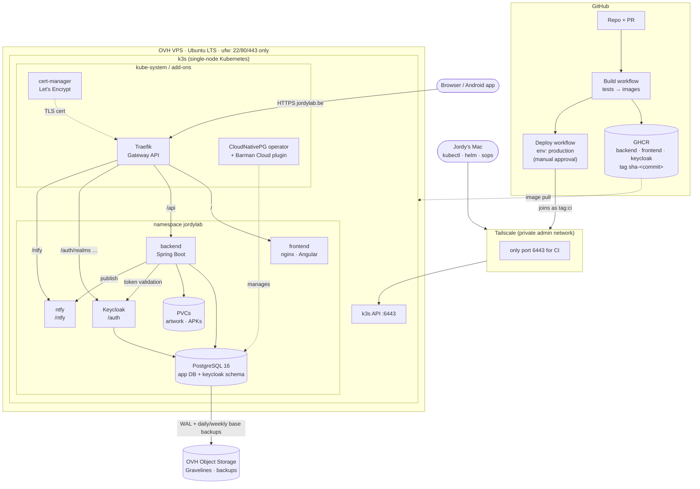

# JordyLab

Personal platform for financial intelligence, health/fitness tracking, game cataloging, and
recipe management — a modular monolith with a separate frontend and Python sidecar. See
`AGENTS.md` for the full architecture and module overview.

## Architecture

Production runs on a single OVH VPS with k3s at **https://jordylab.be**. Local development runs the same
pieces with Podman Compose (see below). How production was built: [
`docs/runbooks/vps-k3s-deployment`](docs/runbooks/vps-k3s-deployment/README.md);
day-to-day operations: the `jordylab-devops` agent (`.claude/agents/`, `.opencode/agents/`).



## Running locally

Three pieces run together: Postgres + Keycloak (via Podman Compose), the Spring Boot backend,
and the Angular frontend.

### Prerequisites

- Java 25, Gradle Wrapper (bundled — `./gradlew`)
- [Bun](https://bun.sh) (`bunx nx ...` runs everything frontend-side — never `npm`/`npx`/`yarn`)
- [Podman](https://podman.io) + Podman Compose (the compose files are runtime-agnostic, so
  Docker + Docker Compose work the same way if you prefer them)

### 1. Configure environment variables

Create `jordylab-be/.env` (git-ignored, never committed):

```bash
POSTGRES_USER=jordylab
POSTGRES_PASSWORD=<any local dev password>
KEYCLOAK_ADMIN=admin
KEYCLOAK_ADMIN_PASSWORD=<any local dev password>
GAMECATALOG_ARTWORK_DIR=/tmp/jordylab-artwork   # a real path — doesn't need to exist yet
ANTHROPIC_API_KEY=<your Anthropic API key>       # required for AI-backed features (FNA
                                                  # briefings, gamecatalog chat/enrichment)
```

These are local bootstrap credentials for the containers below — not production secrets.

### 2. Start Postgres + Keycloak

```bash
cd jordylab-be
podman compose up -d
```

This starts `pgvector/pgvector:pg16` on `localhost:5432` and Keycloak
(`quay.io/keycloak/keycloak`) on `localhost:8180`, with the `jordylab` realm auto-imported from
`compose/keycloak-realm-export.json`. A `jordy` dev user is seeded with the `admin` role (which includes
`guest` and `gamecatalog-scanner`); its password is in that file. The backend's `jordylab-backend` service
client uses the dev-only secret `local-dev-backend-secret-not-for-prod`, already set in
`application-local.yaml`, so Settings → Users works locally without extra configuration.

### 3. Start the backend

```bash
cd jordylab-be
set -a && source .env && set +a
SPRING_PROFILES_ACTIVE=local ./gradlew bootRun
```

Runs on `http://localhost:8080`, validating requests against the Keycloak realm from step 2. The `local`
profile is required: without it the backend stops immediately with *"No valid Spring profile is active"*.

### 3b. Run the backend tests

Tests boot Postgres via Testcontainers, which needs to find the Podman machine socket:

```bash
export DOCKER_HOST=unix://$(podman machine inspect --format '{{.ConnectionInfo.PodmanSocket.Path}}')
export TESTCONTAINERS_RYUK_DISABLED=true   # ryuk needs privileges the Podman socket may not grant
cd jordylab-be && ./gradlew build
```

Give the Podman machine at least 6 GiB of memory (`podman machine stop && podman machine set --memory 6144 &&
podman machine start`): with the default 2 GiB, the later test classes that start their own Keycloak and
Postgres containers fail with `localhost:2375 failed to respond`.

### 4. Start the frontend

```bash
cd jordylab-fe
bun install
bunx nx serve jordylab            # host app, http://localhost:4200 — lazy-loads fna + gamecatalog
```

Or run a single domain standalone, without the host shell (still authenticates against the same
Keycloak realm — see `jordylab-fe/AGENTS.md`'s "Auth via Keycloak" section):

```bash
bunx nx serve fna                 # http://localhost:4300
bunx nx serve gamecatalog         # http://localhost:4400
```

### 5. Your own local admin account

Register at http://localhost:4200 (Keycloak's *Register* link). New accounts have no role and land on
"awaiting approval". Make yours admin — `admin` includes `guest` and `gamecatalog-scanner`, so the scan client
works too — with `kcadm` inside the Keycloak container (it reads the bootstrap admin from the container's env):

```bash
podman exec jordylab-be-keycloak-1 sh -c '/opt/keycloak/bin/kcadm.sh config credentials --server http://localhost:8080 --realm master --user "$KC_BOOTSTRAP_ADMIN_USERNAME" --password "$KC_BOOTSTRAP_ADMIN_PASSWORD" --config /tmp/kc.cfg && /opt/keycloak/bin/kcadm.sh add-roles -r jordylab --uusername you@example.com --rolename admin --config /tmp/kc.cfg; rm -f /tmp/kc.cfg'
```

Log out and in again to get the role in your token. Forgot the local password? Keycloak admin console at
http://localhost:8180/admin (user/password = `KEYCLOAK_ADMIN` / `KEYCLOAK_ADMIN_PASSWORD` from `.env`) → realm
**jordylab** → Users → your account → **Credentials** → **Reset password** (switch *Temporary* off). Local and
production are separate Keycloaks with separate passwords.

A Keycloak that imported the realm **before** the fixed dev backend secret existed keeps its old random one.
Align it once (the import never re-runs on an existing realm):

```bash
podman exec jordylab-be-keycloak-1 sh -c 'K=/opt/keycloak/bin/kcadm.sh; C="--config /tmp/kc.cfg"; $K config credentials --server http://localhost:8080 --realm master --user "$KC_BOOTSTRAP_ADMIN_USERNAME" --password "$KC_BOOTSTRAP_ADMIN_PASSWORD" $C && ID=$($K get clients -r jordylab -q clientId=jordylab-backend --fields id $C | sed -n "s/.*\"id\" : \"\(.*\)\".*/\1/p") && $K update clients/$ID -r jordylab -s secret=local-dev-backend-secret-not-for-prod $C; rm -f /tmp/kc.cfg'
```

### Ports at a glance

| Service | Port |
|---|---|
| Backend API | 8080 |
| Keycloak | 8180 |
| Postgres | 5432 |
| Frontend host (`jordylab`) | 4200 |
| `fna` standalone harness | 4300 |
| `gamecatalog` standalone harness | 4400 |

## Repository structure

See `AGENTS.md` for the module breakdown, AI routing, and infrastructure notes. Sub-project
conventions live in each subdirectory's own `AGENTS.md` (`jordylab-be`, `jordylab-fe`,
`garmin-sync-service`).

## Licence

This repository is public so the code can be read, but it isn't open source: all rights are
reserved. You're welcome to look around, but copying, modifying, or reusing any part of it
requires my permission first. See [`LICENSE`](LICENSE) for the exact terms, and get in touch with
me (Jordy Swinnen) if you'd like to use something here.
